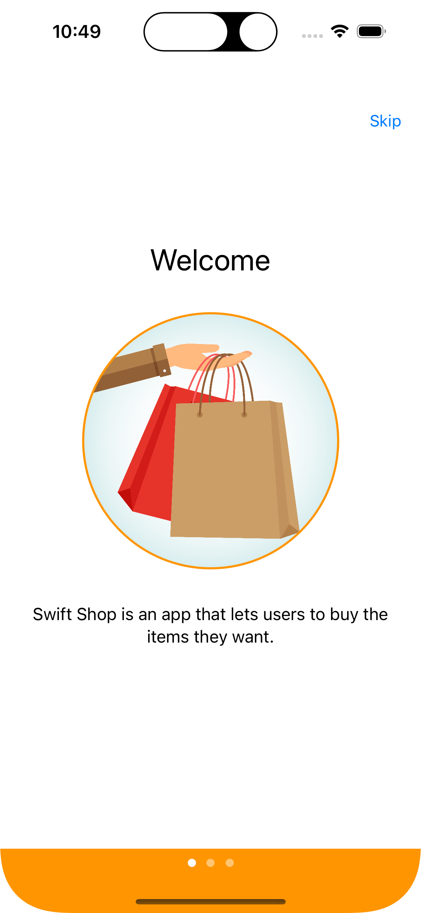
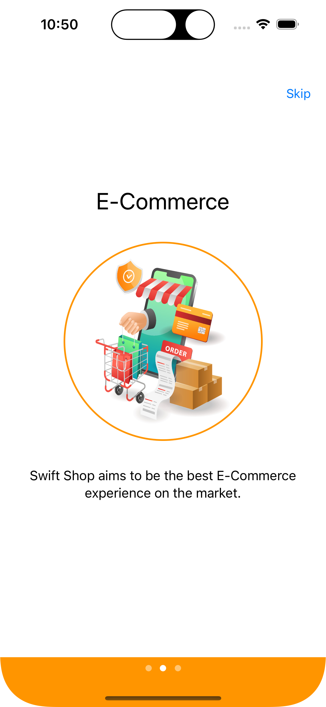
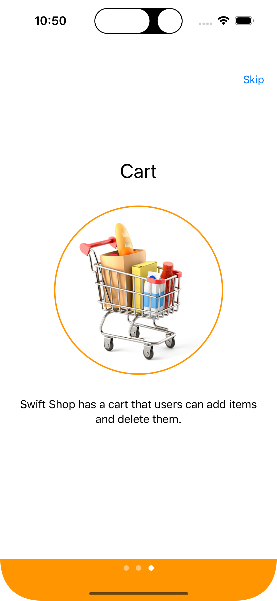
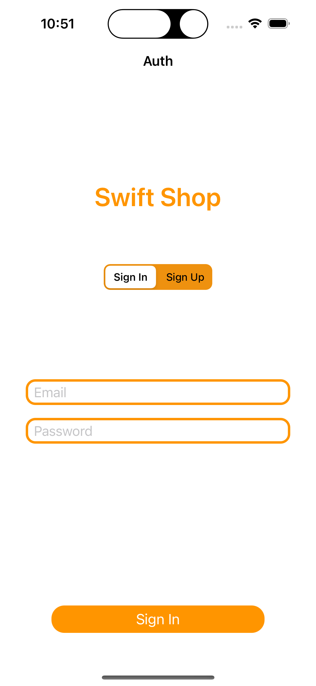
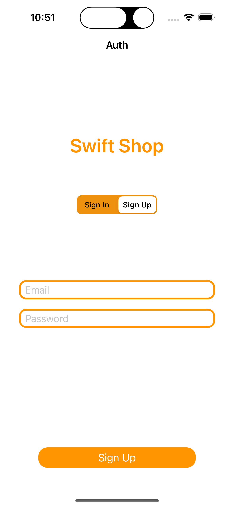
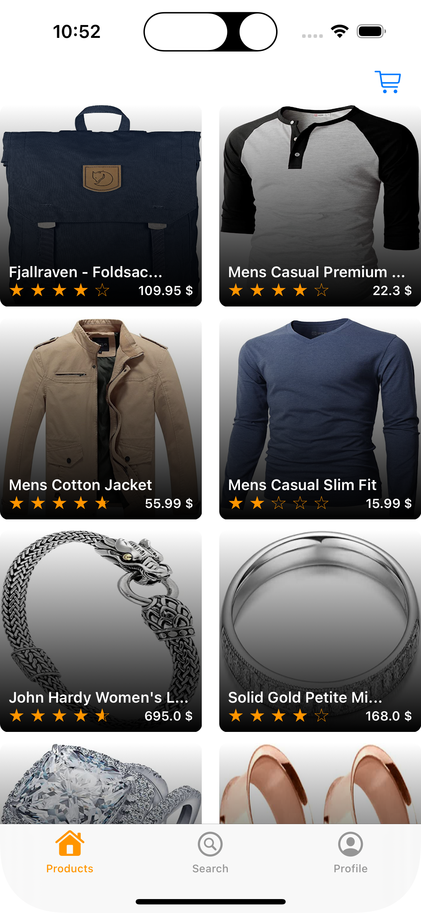
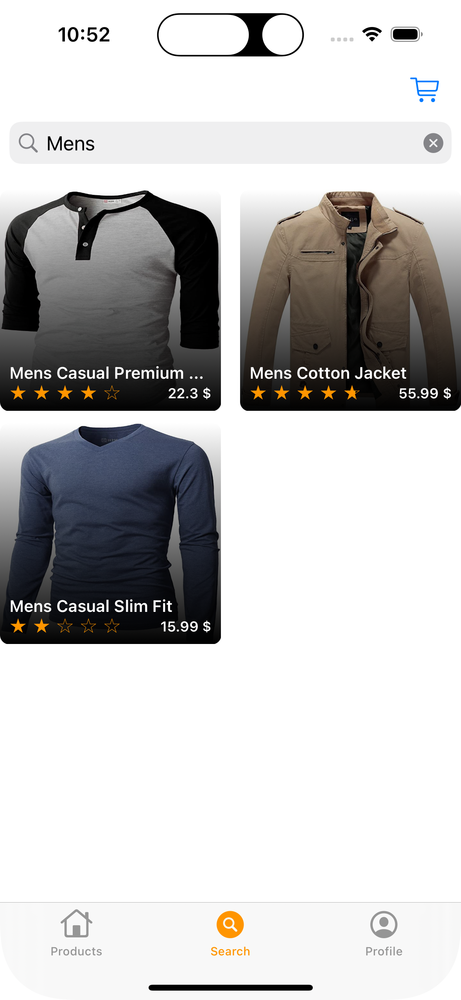
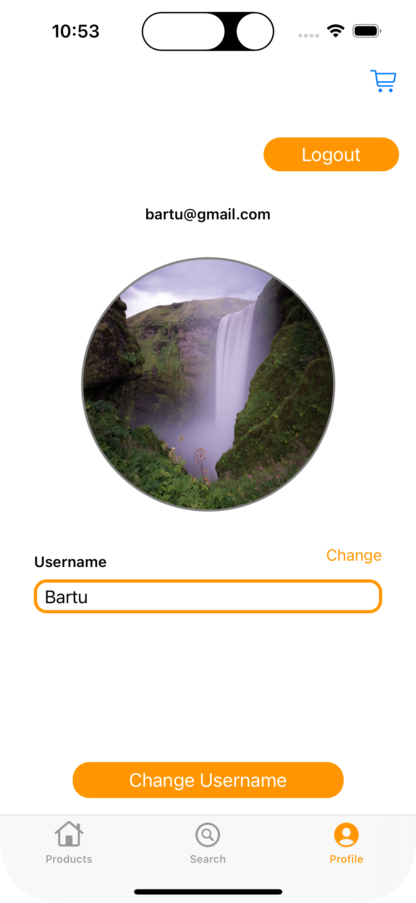
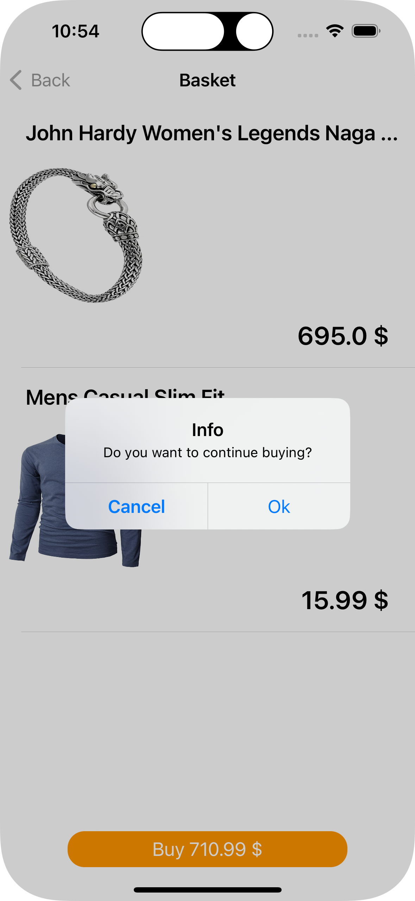
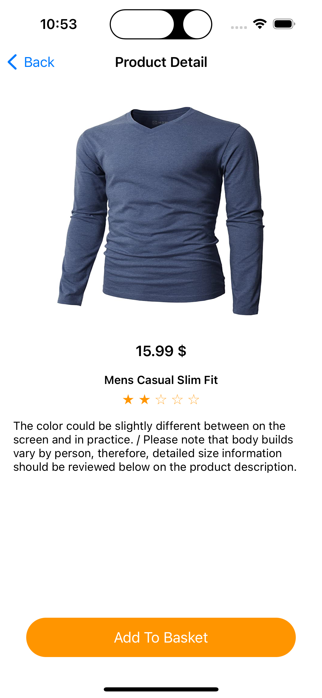

 
  

<h1 align="center"> 🛒 Swift Shop 🛒 </h1>

<h2>
  About :grey_question:
</h2>

  Swift Shop is an E-Commerce application where users can register and shop.

<h2>
  Flow :ocean:
</h2>

  When you start the app it welcomes you with a Splash Screen that has a Lottie Animation. After that it navigates you to the 3 page Onboarding Screen and it only display once to the user. Onboarding Screen navigates you to the Login Screen and here you can Sign In and Sign Up. After signin in to the application, it navigates you to the main screen and there are 3 tabs in there called Products, Search and Basket. In Products you can click a product and see its details. In details screen you can add that product to your cart. You can delete or buy that item on cart. In Search Screen you can search every item available. In Profile Screen you can change your profile image and username. There is also a Logout button on top right, it logs the user out and redirect the user to the login page.

<h2>Features 📱</h2>
<ul>
  <li>Fully Programmatic UI</li>
  <li>MVVM Design Pattern</li>
  <li>User Defaults</li>
  <li>Firebase</li>
  <li>Moya</li>
  <li>Snapkit</li>
</ul>
<h2>
  Screenshots :camera_flash:
</h2>
<h3>Onboarding Screen</h3>

    
    
    

<h3>Authentication Screen</h3>

    
    

<h3>Main Tabs</h3>

    
    
    

<h3>Basket & Detail Tabs</h3>

    
    

<h1> Installation </h1>

### How to run the example?

1. Clone this repo
1. Open shell window and navigate to project folder
1. Run `pod install`
1. Open `ShoppingApp.xcodeproj` and run the project on selected device or simulator
